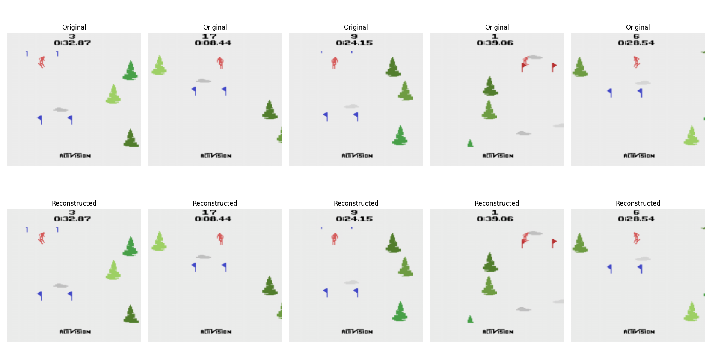

# VQ-VAE

[](https://colab.research.google.com/github/AndrewBoessen/CSCI3387_Notebooks/blob/main/CNN_Based_VAE.ipynb)

This repository contains a PyTorch implementation of the Vector Quantized Variational Autoencoder (VQ-VAE) network.


## Introduction

VQ-VAE (Vector Quantized Variational Autoencoder) is a type of generative model that combines ideas from vector quantization and variational autoencoders. It was introduced in the paper "Neural Discrete Representation Learning" by van den Oord et al. This implementation aims to provide a flexible and efficient PyTorch version of the VQ-VAE architecture.

## Network Architecture

The VQ-VAE consists of three main components:

1. **Encoder**: Transforms the input data into a discrete latent representation.

   - Structure: A series of convolutional layers followed by batch normalization and ReLU activations.
   - Final layer: Outputs a tensor with shape (batch_size, num_embeddings, height, width).

2. **Vector Quantizer**: Quantizes the encoder output to the nearest embedding vectors.

   - Embedding space: A codebook of K embedding vectors, each of dimension D.
   - Quantization process:
     a. Compute L2 distances between encoder outputs and embedding vectors.
     b. Select the nearest embedding vector for each spatial location.
     c. Replace encoder outputs with the selected embedding vectors.
   - Gradient estimation: Uses straight-through estimator to allow gradients to flow through the non-differentiable argmin operation.

3. **Decoder**: Reconstructs the input from the quantized representation.
   - Structure: Mirrors the encoder with transposed convolutions for upsampling.
   - Final layer: Outputs a tensor with the same shape as the input data.

Key features and components:

- **Discrete Latent Space**: Unlike traditional VAEs, VQ-VAE uses a discrete latent representation, which can lead to more interpretable and controllable latent codes.

- **Codebook**: A learnable embedding table (codebook) of size K x D, where K is the number of discrete codes and D is the dimensionality of each code.

- **Commitment Loss**: Encourages the encoder to commit to embedding vectors, calculated as:

  ```
  commitment_loss = ||sg(ze) - e||^2 + β||ze - sg(e)||^2
  ```

  where `ze` is the encoder output, `e` is the closest embedding vector, `sg()` is the stop-gradient operator, and β is a hyperparameter (typically set to 0.25).

- **Reconstruction Loss**: Measures the difference between the input and the reconstructed output, typically using Mean Squared Error (MSE) for images or cross-entropy for discrete data.

- **Total Loss**: The sum of the reconstruction loss and the commitment loss.

The forward pass through the network proceeds as follows:

1. Input data is encoded to produce latent representations.
2. Latent representations are quantized using the nearest embedding vectors.
3. Quantized representations are passed through the decoder to reconstruct the input.
4. Losses are computed and backpropagated, with special handling for the non-differentiable quantization step.

This architecture allows the VQ-VAE to learn a discrete latent representation of the input data, which can be useful for various downstream tasks such as compression, generation, and representation learning.

## Installation

```bash
git clone https://github.com/AndrewBoessen/vq-vae.git
cd vq-vae

conda create -n vqvae python=3.12
conda activate vqvae
conda install scipy scikit-learn
pip install -r requirements.txt
```

## Usage

Run demo to reconstruct image and plot codebook embeddings

```
python demo.py
```

Or use [Colab demo](https://colab.research.google.com/assets/colab-badge.svg)](https://colab.research.google.com/github/AndrewBoessen/CSCI3387_Notebooks/blob/main/CNN_Based_VAE.ipynb)

## Training

Our training process incorporates several key techniques to improve the performance and stability of the VQ-VAE:

1. **EMA Vector Quantizer**: We use an Exponential Moving Average (EMA) update for the embedding vectors in the Vector Quantizer. This helps to stabilize training and prevent codebook collapse.

2. **Pretrained Encoder**: The encoder is pretrained before training the embeddings. This allows the encoder to learn meaningful representations of the input data before quantization is introduced.

3. **K-means Initialization**: We initialize the embedding vectors using the K-means clustering algorithm. This provides a good starting point for the codebook, helping to speed up convergence and improve final performance.

The training process follows these steps:

1. Pretrain the encoder on the dataset.
2. Initialize the embedding vectors using K-means clustering on the pretrained encoder's output.
3. Train the full VQ-VAE model, including the encoder, vector quantizer, and decoder, using the EMA update for the embedding vectors.

```
python train.py
```

## Results

### Reconstructions



### Embeddings


## Contributing

Contributions are welcome! Please feel free to submit a Pull Request.

## License

This project is licensed under the [MIT License](LICENSE).
